# NLP - Natural Language Programming to achieve simple tasks faster.

## Introduction

I've been an owner of a 3D printer for quite some time. It's not uncommon for me to engage in discussions about 3D 
printing. Interestingly, despite the common belief that smartphones don't listen in on our conversations, I've noticed an 
increase in ads related to 3D printing topics. One such ad introduced me to STLFlix, a site offering a 
monthly subscription for access to over 1000 3D designs. They update their collection weekly, and subscribers are 
legally allowed to sell the models they print. The cost? About 3000 ARS a month, which seemed like a bargain considering 
I've previously paid between 500 and 1000 ARS for similar designs on other sites.

After subscribing to STLFlix, I started printing various models. As days went by, some models turned out great, 
while others didn't, and before I knew it, I only had about ten days left on my subscription. By then, I had downloaded 
just 10 to 15 files from the vast collection that initially intrigued me. I tend to be forgetful, so I always make sure 
to cancel monthly subscriptions to avoid unnecessary charges. With limited time left, I wanted to maximize my 
subscription's value. However, the prospect of downloading over a thousand files individually was daunting—not exactly 
a fun or efficient use of time.

This is where my ChatGPT subscription came into play. I used it to streamline this task efficiently and enjoyably, 
without needing to code myself (although I did tweak a few things—is that considered coding?). 
By the end of this blog post/tutorial, I hope to show you, whether you're an AI novice or enthusiast, the incredible 
potential these tools offer in enhancing our daily productivity.

## Manos a la obra!

Ever since I've started with this thing I call **Natural Language ~~Processing~~ Programming**, I've gone through a few scripting languages. 
I started with bash scripts because they're really easy to run in any environment that has a bash shell. 
The thing is, I'm not a bash expert, and language models are far from perfect. So, whenever there was a mistake, it was hard 
for me to quickly fix any syntax or logical errors. Then, I turned to Python. I'm not sure why, as I'm not really a 
Python programmer either, and its syntax and environment setup don't come naturally to me, even though I've done it before. 
Lately, I've started using Groovy, which is a scripting language on top of Java. It's very flexible and powerful. 
It comes naturally to me since I'm really familiar with the Java ecosystem. So, if you're a Java developer like me, I strongly 
recommend you check out Groovy if you haven't. And if you don't like Java, I'm sure you can apply the concepts from 
this blog by asking for scripts in any language of your choice.

### We need a plan.

Headed to the page and logged in, they have an explorer that lets you filter by some attributes or make a search.

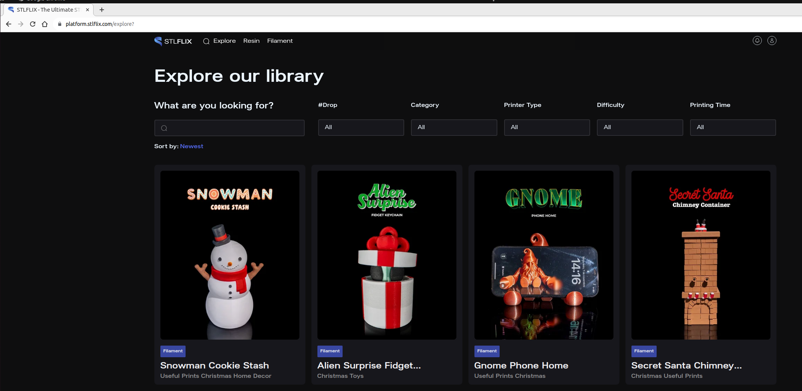

Having worked in web development, I had a good idea of what I was looking for. Depending on the age of the page, 
my approach would be different. For older pages, I would need to parse the HTML and extract the necessary data. 
More modern pages often have an API they use to retrieve data, which I could potentially access. I went 
straight to Chrome Developer Tools, opened the Network tab and reloaded the page. Luckily, going through all the 
request the page have made, I quickly found something with an interesting name.

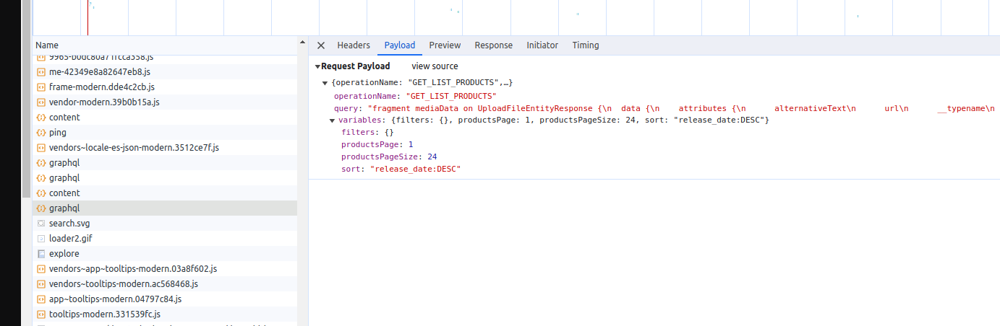

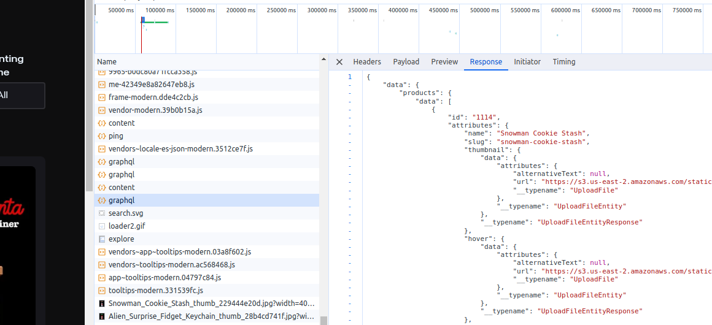

A GraphQL request named GET_LIST_PRODUCTS, sounds useful for what we intend to do, right? If we're going to download every
file, we will need a list of all the files. Response looks super useful as well, it has the **name** and the **ID** of the items
on the page.

*Item from data.products.data list in the JSON response.*
```json
{
  "id": "1114",
  "attributes": {
    "name": "Snowman Cookie Stash",
    "slug": "snowman-cookie-stash",
    "thumbnail": {
      "data": {
        "attributes": {
          "alternativeText": null,
          "url": "https://s3.us-east-2.amazonaws.com/static.stlflix.com/Snowman_Cookie_Stash_thumb_229444e20d.jpg",
          "__typename": "UploadFile"
        },
        "__typename": "UploadFileEntity"
      },
      "__typename": "UploadFileEntityResponse"
    },
    "hover": {
      "data": {
        "attributes": {
          "alternativeText": null,
          "url": "https://s3.us-east-2.amazonaws.com/static.stlflix.com/Snowman_Cookie_Stash_WEBM_3bdc4c6a55.webm",
          "__typename": "UploadFile"
        },
        "__typename": "UploadFileEntity"
      },
      "__typename": "UploadFileEntityResponse"
    },
    "categories": {
      "data": [
        {
          "id": "16",
          "attributes": {
            "slug": "useful-prints",
            "name": "Useful Prints",
            "__typename": "Category"
          },
          "__typename": "CategoryEntity"
        },
        {
          "id": "37",
          "attributes": {
            "slug": "christmas-1",
            "name": "Christmas",
            "__typename": "Category"
          },
          "__typename": "CategoryEntity"
        },
        {
          "id": "10",
          "attributes": {
            "slug": "home-decor",
            "name": "Home Decor",
            "__typename": "Category"
          },
          "__typename": "CategoryEntity"
        }
      ],
      "__typename": "CategoryRelationResponseCollection"
    },
    "tags": {
      "data": [
        {
          "id": "6",
          "attributes": {
            "slug": "intermediate",
            "name": "Intermediate",
            "__typename": "Tag"
          },
          "__typename": "TagEntity"
        },
        {
          "id": "2",
          "attributes": {
            "slug": "filament",
            "name": "Filament",
            "__typename": "Tag"
          },
          "__typename": "TagEntity"
        },
        {
          "id": "10",
          "attributes": {
            "slug": "very-long-more-than-12-hours",
            "name": "Very Long (More than 12 hours)",
            "__typename": "Tag"
          },
          "__typename": "TagEntity"
        }
      ],
      "__typename": "TagRelationResponseCollection"
    },
    "__typename": "Product"
  },
  "__typename": "ProductEntity"
}
```

Then I clicked on one of the products, it opened a new page, on which I kept looking at the requests shown in Network tab 
of Chrome Developer Tools. Again quickly found something quite useful.

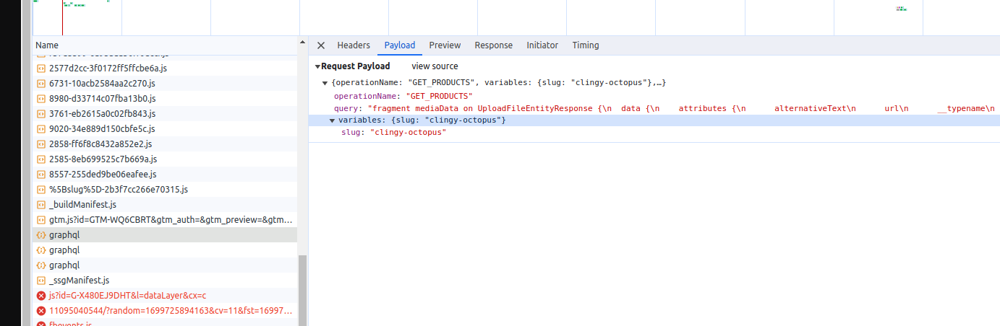

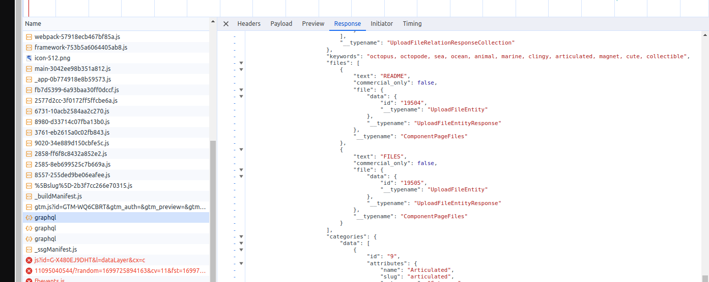

It seems that this is the API call that fetches the information for the whole product page. It doesn't take an ID as 
parameter as one would expect, it takes the *slug*, and uses that to fetch even more information about this item than
the previous API call I saw. What specially caught my eye about this request, was that this response had an item 
called *files*, and each of these items had another ID. Another interesting thing about this response is that it has a
*gallery* item, and if we're going to download every .stl file there is, we'll need images to know what is in each file.

*JSON response from GET_PRODUCTS call*
```json
{
    "data": {
        "products": {
            "data": [
                {
                    "__typename": "ProductEntity",
                    "id": "1105",
                    "attributes": {
                        "name": "Clingy Octopus ",
                        "slug": "clingy-octopus",
                        "description": "<p><span style=\"background-color:transparent;color:#3498DB;\"><strong>3D MODEL DESCRIPTION</strong></span><br>&nbsp;</p><p>This cute octopus is not that clingy, it just loves everything too much.&nbsp;</p><p>&nbsp;</p><ul><li><span style=\"background-color:transparent;color:hsl(0,0%,0%);\">This STL file is recommended for FDM Printers!</span></li><li><span style=\"background-color:transparent;color:hsl(0,0%,0%);\">3D Printing Time Based on <strong>Ender 3</strong>: 12 Hours 09 Minutes<strong> (will vary accord to you printer model)</strong></span></li><li><span style=\"background-color:transparent;color:hsl(0,0%,0%);\">Approximately Height:&nbsp;4,7 cm</span></li><li><strong>You will need n</strong><span style=\"background-color:rgb(255,255,255);color:rgb(77,81,86);\"><strong>eodymium </strong></span><strong>magnets 5mm X 3mm</strong><br>&nbsp;</li></ul><p>&nbsp;</p><p><span style=\"background-color:transparent;color:#3498DB;\"><strong>3D PRINT FILE SETTINGS (FOR 0.4 MM NOZZLE)</strong></span></p><p>&nbsp;</p><ul><li><span style=\"background-color:transparent;color:hsl(0,0%,0%);\"><strong>Line Width/ Nozzle:&nbsp;</strong>0.4 mm</span></li><li><span style=\"background-color:transparent;color:hsl(0,0%,0%);\"><strong>First Layer Line Width:&nbsp;</strong>0.48 mm / 120%</span></li><li><span style=\"background-color:transparent;color:hsl(0,0%,0%);\"><strong>Average Speed:&nbsp;</strong>20mm/s (First Layer) / 50mm/s (All the other layers) | 20 mm/s (First Layer) / 500 mm/s (All the other layers on Bambu Lab)</span></li><li><span style=\"background-color:transparent;color:hsl(0,0%,0%);\"><strong>Recommended Initial Layer Height:&nbsp; </strong>0.16 mm</span></li><li><span style=\"background-color:transparent;color:hsl(0,0%,0%);\"><strong>Recommended Layer Height:&nbsp; </strong>0.16 mm</span></li><li><span style=\"background-color:transparent;color:hsl(0,0%,0%);\"><strong>Recommended Perimeters/ Walls:&nbsp;</strong>3.</span></li><li><span style=\"background-color:transparent;color:hsl(0,0%,0%);\"><strong>Recommended Infill (%):&nbsp;</strong>10% (Gyroid)</span></li><li><span style=\"background-color:transparent;color:hsl(0,0%,0%);\"><strong>Needs Support: </strong>No.</span></li><li><span style=\"background-color:transparent;color:hsl(0,0%,0%);\"><strong>Build Plate Adhesion:&nbsp;</strong>Skirt.</span></li></ul><p><span style=\"background-color:transparent;color:#000000;\">&nbsp;</span></p><p><span style=\"background-color:transparent;color:#3498DB;\"><strong>3D TECHNICAL OVERVIEW</strong></span></p><p>&nbsp;</p><p><a href=\"https://youtu.be/GJbi6cKGmpw\" target=\"_blank\" rel=\"noopener noreferrer\">https://youtu.be/GJbi6cKGmpw</a></p><p>&nbsp;</p><p><span style=\"background-color:transparent;color:#3498DB;\"><strong>The parameters above are recommendations made by our staff; if you prefer, you can adapt them according to your preferences.</strong></span><br><br>&nbsp;</p><p><span style=\"background-color:transparent;color:#3498DB;\"><i><strong>Happy Printing!</strong></i></span></p><p>&nbsp;</p>",
                        "iframe": null,
                        "updatedAt": "2023-11-04T18:25:15.774Z",
                        "bambu_file": {
                            "data": {
                                "id": "19503",
                                "__typename": "UploadFileEntity"
                            },
                            "__typename": "UploadFileEntityResponse"
                        },
                        "stl_preview": {
                            "data": null,
                            "__typename": "UploadFileEntityResponse"
                        },
                        "release_date": "2023-11-03",
                        "comments": {
                            "data": [
                                {
                                    "attributes": {
                                        "users_permissions_user": {
                                            "data": {
                                                "attributes": {
                                                    "username": "SHAKA3D",
                                                    "__typename": "UsersPermissionsUser"
                                                },
                                                "__typename": "UsersPermissionsUserEntity"
                                            },
                                            "__typename": "UsersPermissionsUserEntityResponse"
                                        },
                                        "text": "Fun easy print thanks ",
                                        "createdAt": "2023-11-04T02:12:17.382Z",
                                        "__typename": "Comment",
                                        "reply_comments": {
                                            "data": [],
                                            "__typename": "CommentRelationResponseCollection"
                                        }
                                    },
                                    "__typename": "CommentEntity"
                                },
                                {
                                    "attributes": {
                                        "users_permissions_user": {
                                            "data": {
                                                "attributes": {
                                                    "username": "pmurph89",
                                                    "__typename": "UsersPermissionsUser"
                                                },
                                                "__typename": "UsersPermissionsUserEntity"
                                            },
                                            "__typename": "UsersPermissionsUserEntityResponse"
                                        },
                                        "text": "I’m not sure if I messed with the original file, but my multicolor model printed the body color in parts of the eye along with the 3 other colors. ",
                                        "createdAt": "2023-11-06T04:38:33.777Z",
                                        "__typename": "Comment",
                                        "reply_comments": {
                                            "data": [],
                                            "__typename": "CommentRelationResponseCollection"
                                        }
                                    },
                                    "__typename": "CommentEntity"
                                },
                                {
                                    "attributes": {
                                        "users_permissions_user": {
                                            "data": {
                                                "attributes": {
                                                    "username": "poetspoet@gmail.com",
                                                    "__typename": "UsersPermissionsUser"
                                                },
                                                "__typename": "UsersPermissionsUserEntity"
                                            },
                                            "__typename": "UsersPermissionsUserEntityResponse"
                                        },
                                        "text": "would be great with a captive magnet option",
                                        "createdAt": "2023-11-06T18:02:33.929Z",
                                        "__typename": "Comment",
                                        "reply_comments": {
                                            "data": [],
                                            "__typename": "CommentRelationResponseCollection"
                                        }
                                    },
                                    "__typename": "CommentEntity"
                                }
                            ],
                            "__typename": "CommentRelationResponseCollection"
                        },
                        "__typename": "Product",
                        "thumbnail": {
                            "data": {
                                "attributes": {
                                    "alternativeText": null,
                                    "url": "https://s3.us-east-2.amazonaws.com/static.stlflix.com/Clingy_Octopus_thumb_36a7d44337.jpg",
                                    "__typename": "UploadFile"
                                },
                                "__typename": "UploadFileEntity"
                            },
                            "__typename": "UploadFileEntityResponse"
                        },
                        "hover": {
                            "data": {
                                "attributes": {
                                    "alternativeText": null,
                                    "url": "https://s3.us-east-2.amazonaws.com/static.stlflix.com/WEBM_Clingy_Octopus_f83f27dd82.webm",
                                    "__typename": "UploadFile"
                                },
                                "__typename": "UploadFileEntity"
                            },
                            "__typename": "UploadFileEntityResponse"
                        },
                        "gallery": {
                            "data": [
                                {
                                    "id": "19547",
                                    "attributes": {
                                        "alternativeText": null,
                                        "url": "https://s3.us-east-2.amazonaws.com/static.stlflix.com/Clingy_Octopus_1_896d4bb255.jpg",
                                        "__typename": "UploadFile"
                                    },
                                    "__typename": "UploadFileEntity"
                                },
                                {
                                    "id": "19545",
                                    "attributes": {
                                        "alternativeText": null,
                                        "url": "https://s3.us-east-2.amazonaws.com/static.stlflix.com/Clingy_Octopus_2_06e663059a.jpg",
                                        "__typename": "UploadFile"
                                    },
                                    "__typename": "UploadFileEntity"
                                },
                                {
                                    "id": "19548",
                                    "attributes": {
                                        "alternativeText": null,
                                        "url": "https://s3.us-east-2.amazonaws.com/static.stlflix.com/Clingy_Octopus_3_4bbffb7ebe.jpg",
                                        "__typename": "UploadFile"
                                    },
                                    "__typename": "UploadFileEntity"
                                },
                                {
                                    "id": "19546",
                                    "attributes": {
                                        "alternativeText": null,
                                        "url": "https://s3.us-east-2.amazonaws.com/static.stlflix.com/Clingy_Octopus_4_c2864b8b80.jpg",
                                        "__typename": "UploadFile"
                                    },
                                    "__typename": "UploadFileEntity"
                                },
                                {
                                    "id": "19549",
                                    "attributes": {
                                        "alternativeText": null,
                                        "url": "https://s3.us-east-2.amazonaws.com/static.stlflix.com/Clingy_Octopus_5_7b43b66fc7.jpg",
                                        "__typename": "UploadFile"
                                    },
                                    "__typename": "UploadFileEntity"
                                }
                            ],
                            "__typename": "UploadFileRelationResponseCollection"
                        },
                        "keywords": "octopus, octopode, sea, ocean, animal, marine, clingy, articulated, magnet, cute, collectible",
                        "files": [
                            {
                                "text": "README",
                                "commercial_only": false,
                                "file": {
                                    "data": {
                                        "id": "19504",
                                        "__typename": "UploadFileEntity"
                                    },
                                    "__typename": "UploadFileEntityResponse"
                                },
                                "__typename": "ComponentPageFiles"
                            },
                            {
                                "text": "FILES",
                                "commercial_only": false,
                                "file": {
                                    "data": {
                                        "id": "19505",
                                        "__typename": "UploadFileEntity"
                                    },
                                    "__typename": "UploadFileEntityResponse"
                                },
                                "__typename": "ComponentPageFiles"
                            }
                        ],
                        "categories": {
                            "data": [
                                {
                                    "id": "9",
                                    "attributes": {
                                        "name": "Articulated",
                                        "slug": "articulated",
                                        "__typename": "Category"
                                    },
                                    "__typename": "CategoryEntity"
                                },
                                {
                                    "id": "19",
                                    "attributes": {
                                        "name": "Animals",
                                        "slug": "animals",
                                        "__typename": "Category"
                                    },
                                    "__typename": "CategoryEntity"
                                }
                            ],
                            "__typename": "CategoryRelationResponseCollection"
                        },
                        "tags": {
                            "data": [
                                {
                                    "attributes": {
                                        "name": "Filament",
                                        "parent_tag": {
                                            "data": {
                                                "attributes": {
                                                    "name": "Printer Type",
                                                    "__typename": "ParentTag"
                                                },
                                                "__typename": "ParentTagEntity"
                                            },
                                            "__typename": "ParentTagEntityResponse"
                                        },
                                        "__typename": "Tag"
                                    },
                                    "__typename": "TagEntity"
                                },
                                {
                                    "attributes": {
                                        "name": "Intermediate",
                                        "parent_tag": {
                                            "data": {
                                                "attributes": {
                                                    "name": "Difficulty",
                                                    "__typename": "ParentTag"
                                                },
                                                "__typename": "ParentTagEntity"
                                            },
                                            "__typename": "ParentTagEntityResponse"
                                        },
                                        "__typename": "Tag"
                                    },
                                    "__typename": "TagEntity"
                                },
                                {
                                    "attributes": {
                                        "name": "Long (5 hours - 12 hours)",
                                        "parent_tag": {
                                            "data": {
                                                "attributes": {
                                                    "name": "Printing Time",
                                                    "__typename": "ParentTag"
                                                },
                                                "__typename": "ParentTagEntity"
                                            },
                                            "__typename": "ParentTagEntityResponse"
                                        },
                                        "__typename": "Tag"
                                    },
                                    "__typename": "TagEntity"
                                }
                            ],
                            "__typename": "TagRelationResponseCollection"
                        },
                        "related_products": {
                            "data": [],
                            "__typename": "ProductRelationResponseCollection"
                        },
                        "products_related": {
                            "data": [],
                            "__typename": "ProductRelationResponseCollection"
                        },
                        "seo": null
                    }
                }
            ],
            "__typename": "ProductEntityResponseCollection"
        }
    }
}
```

So far I knew how to get all the file IDs, but I still needed to transform these IDs into a file, right? So I've continued
the download flow on the site.

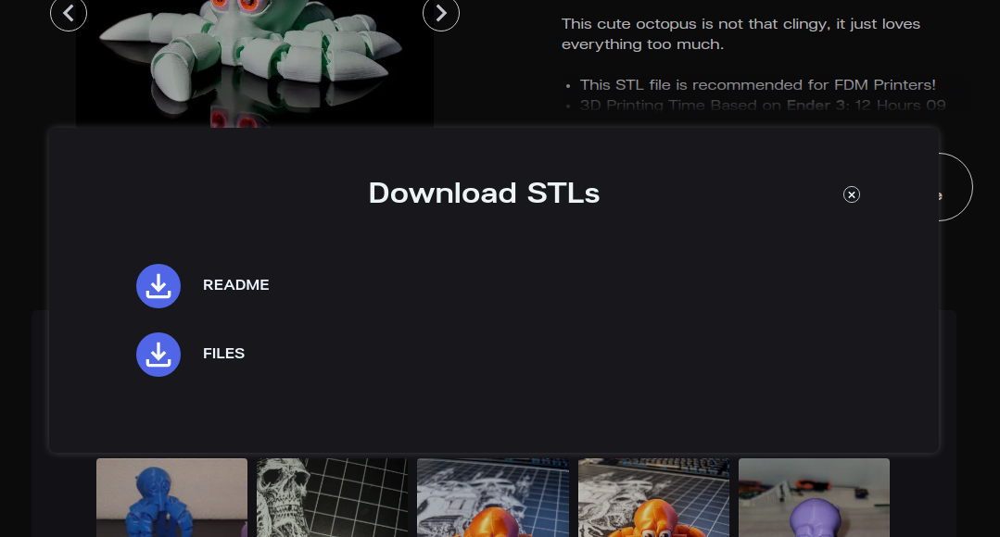

And it immediately triggered the last request I needed.

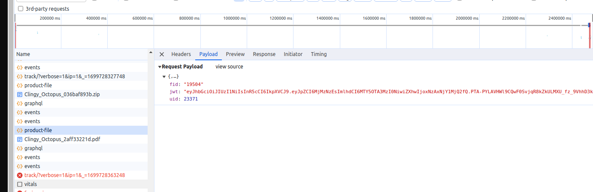

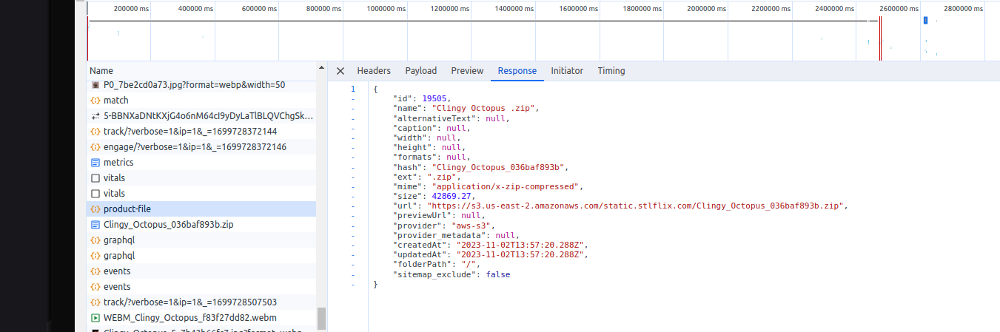

If you pay attention closely, that **fid** number, is the same as the one in the **files** item of the GET_PRODUCTS GraphQL 
response. That probably means that **fid** stands for **file id**. That's it, we have a plan!

### Natural Language Programming

These days, the latest LLMs like ChatGPT, are changing the focus from people needing to have the technical knowledge in order
to achieve some complex task, to just having to think on *what* needs to be done, because we can delegate the *how*, to these AIs.
For example, I don't need to know how to write a script in a language I've never used before, I can just ask ChatGPT to do it for me,
If I know what needs to be done. That is exactly what we're going to do.

There's a very cool functionality in Chrome Developer Tools, that lets you copy one of the request in many formats.
We'll be using that to copy the GET_LIST_PRODUCT GraphQL request as a cURL command.

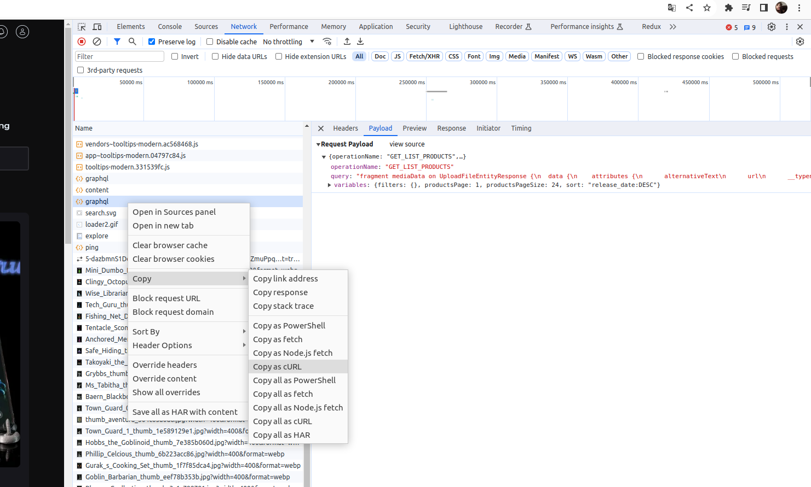

With this curl, lets jump straight to GPT, Look at the following conversation: https://chat.openai.com/share/1e31f543-ed67-4b4e-8641-12f043aec22a

I've asked ChatGPT to:
- Create a groovy script
- Use okHttp client (I'm just used to it) to mimic the cURL request.
- Loop through pages and fetch until there's no more pages.
- Collect the contents of data list into a file.
- Debug statements
- Few fixes to the script

Then saved the file as `STLFlixGraphQLGetProductList.groovy`. When using GPT like this, it doesn't actually execute 
the code it suggests, so it almost always needs a few tweaks to run, even tho sometimes it does run at once. 
Sometimes I fix it myself, sometimes I ask ChatGPT to fix it for me. Here's the difference between what I've built 
from what ChatGPT suggested vs what I ended up running: https://www.diffchecker.com/1tu65xzf/

Let's run it.

```
groovy STLFlixGraphQLGetProductList.groovy
```

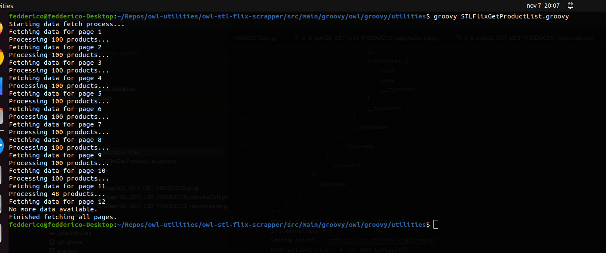

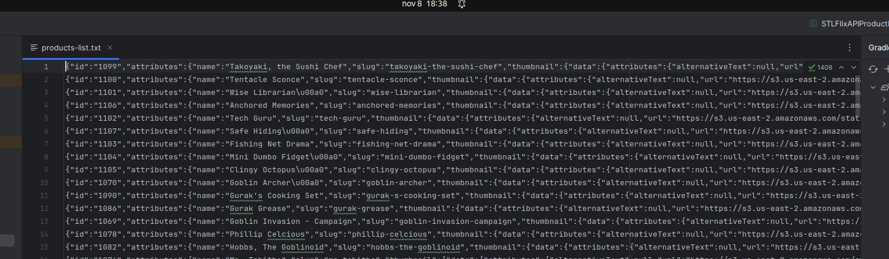

Now we have all the **slugs** we need to make the GraphQL GET_PRODUCT request. So lets follow the same strategy as before.

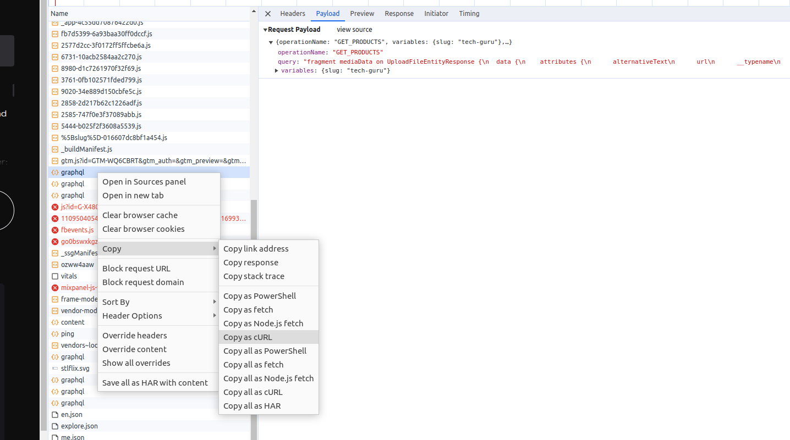

Look at the following conversation: https://chat.openai.com/share/75098574-ed64-4c78-8999-9b0dac33886e

I've asked ChatGPT to:
- Create a groovy script
- Use okHttp client to mimic the cURL request.
- Parse a file to get the slug input
- Save results to a configurable file, collect contents of data list.
- Debug statements
- Few fixes to the script.

Then saved the file as `STLFlixGraphQLGetProducts.groovy`, Here's the difference between what I've built
from what ChatGPT suggested vs what I ended up running: https://www.diffchecker.com/8QGBFTtR/

Let's run it.

```
groovy STLFlixGraphQLGetProductList.groovy
``` 

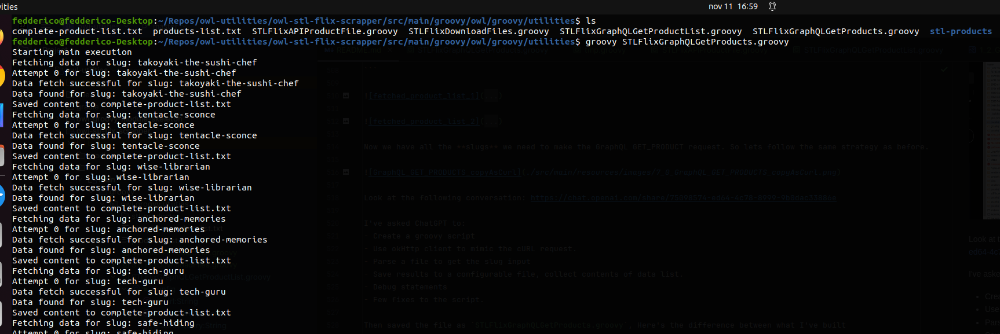

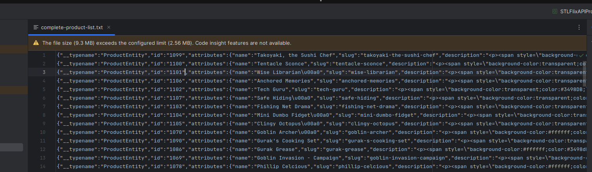

___

TBD.

[Reword] Now I have all the information I need to get the file links, when I click to download a File, there's a 
PRODUCT_FILE call that gets the link to download the file. 

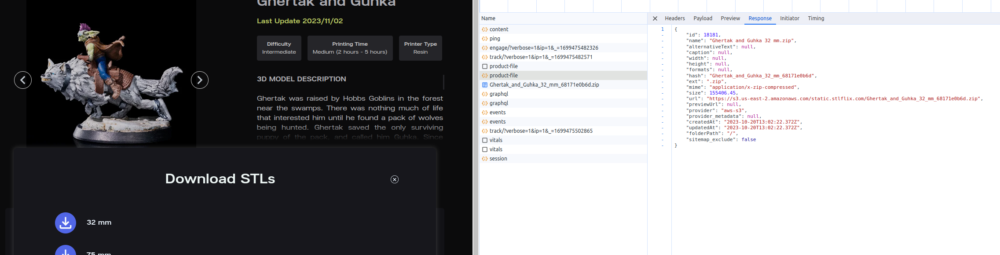

[Reword] Follow same copyAsCurl procedure and ask GPT for a script that can loop through the files for the FID we've
collected in earlier step.

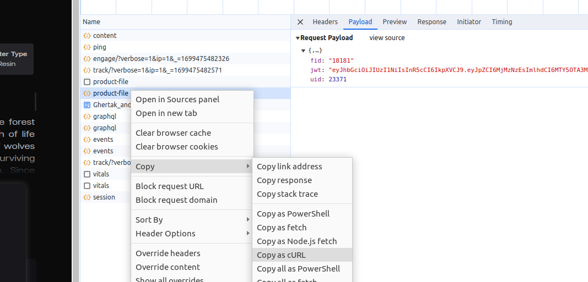

[GPT-4 Chat] https://chat.openai.com/share/fa5aa9d4-623b-49e0-a6c4-51045bcbcada

[Reword] Analysis of fixes to the script.

[TBD] Difference between what GPT gave me and what I've ended up executing.

[Reword] Run the script.

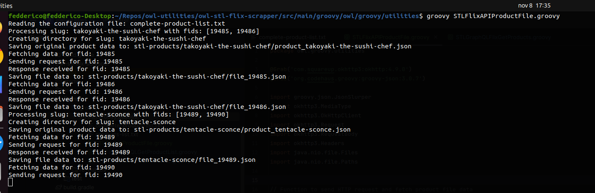

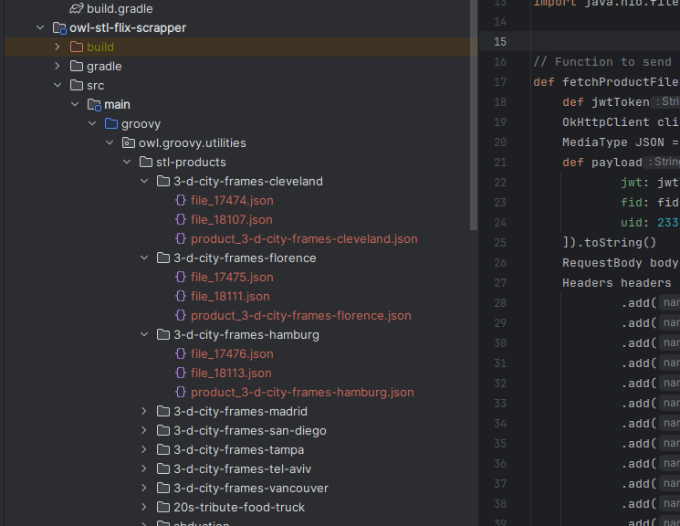

[Reword] Now I have a single folder, with all the information I need in order to get the files/images I want.
All I need to do is come up with a script that can use the gathered links to download them.

[GPT-4 Chat] https://chat.openai.com/share/612df2d3-6e28-4d2e-b73e-b2da0fb52138

[TBD] Difference between what GPT gave me and what I've ended up executing.

[Reword] Run the script.

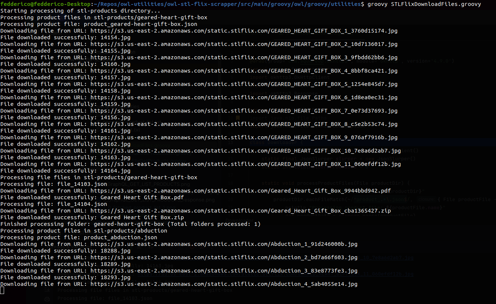

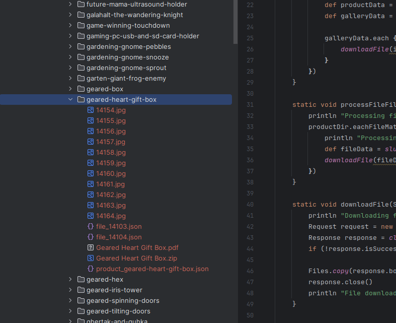

[Reword] And that's it, we have all the files.


